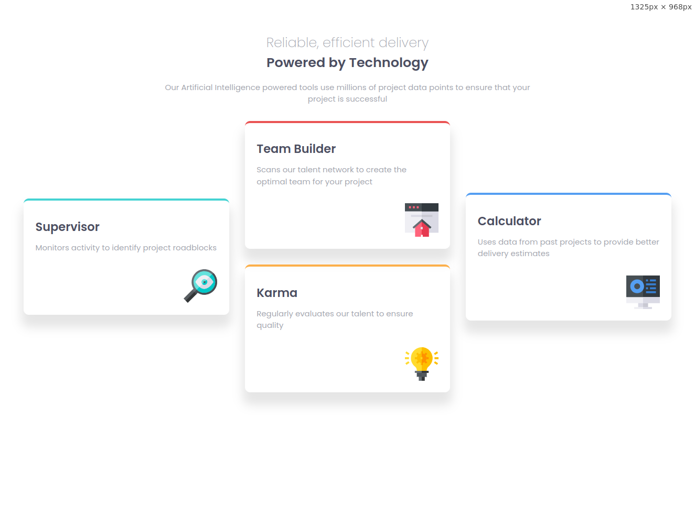

# Frontend Mentor - Four card feature section solution

This is a solution to the [Four card feature section challenge on Frontend Mentor](https://www.frontendmentor.io/challenges/four-card-feature-section-weK1eFYK). Frontend Mentor challenges help you improve your coding skills by building realistic projects. 

### The challenge

Users should be able to:

- View the optimal layout for the site depending on their device's screen size

### Screenshot

### Links

- Solution URL: [github](https://github.com/mostafa-hsh/four-card-feature-section)
- Live Site URL: [github pages](https://mostafa-hsh.github.io/Four-card-feature-section/)

### Built with

- Flexbox
- Mobile-first workflow

## Author

- Frontend Mentor - [@mostafa-hsh](https://www.frontendmentor.io/profile/mostafa-hsh)
thanks FRONTEND-MENTOR